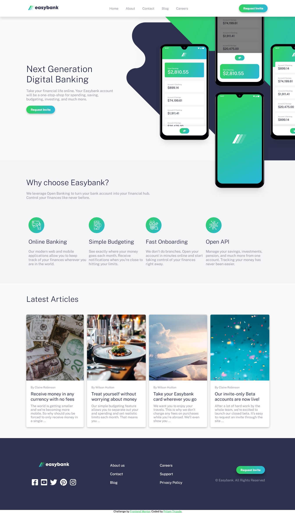

# Frontend Mentor - Easybank landing page


## Table of contents

- [Overview](#overview)
  - [The challenge](#the-challenge)
  - [ Solution Screenshot](#screenshot)
  - [Links](#links)
- [My process](#my-process)
  - [Built with](#built-with)
  - [What I learned](#what-i-learned)
  - [Useful resources](#useful-resources)
- [Author](#author)

## Overview

### The challenge

Users should be able to:

- View the optimal layout for the site depending on their device's screen size
- See hover states for all interactive elements on the page

### Screenshot



### Links

- Solution URL: [Easy Bank Landing Page Solution](https://www.frontendmentor.io/challenges/blogr-landing-page-EX2RLAApP/hub/htmlcsssassjavascriptflexbox-7k8375yN6)
- Live Site URL: [Easy Bank Site](https://blogr-landin-site.netlify.app/)

## My process

### Built with

- Semantic HTML5 markup
- Sass (Syntactically awesome stylesheets)
- CSS custom properties
- Flexbox
- Mobile-first workflow

### What I learned

In this web design the intro section background image and the mobile mockup image is a :confused: tough challenge for me. I tried many methods and a bunch of resources on the internet and then finally after all research :relaxed: and pensive thinking :thinking: `position` and `z-index` property's takes the problem away. Developing this design cleared my all `position` related confusions.

### Useful resources

-[CSS position concept](https://css-tricks.com/almanac/properties/p/position/) - Please checkout this useful article on ```position``` property this cleared my all doubts of relative, absolute, fixed, sticky positions.

## Author

- Frontend Mentor - [@Pritam-Tirpude](https://www.frontendmentor.io/profile/Pritam-Tirpude)
- Twitter - [@ptirpude1991](https://twitter.com/ptirpude1991)
